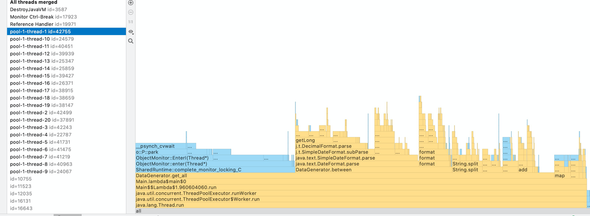

# Nio 造数工具

项目优势，无需依赖其他东西，只需要 java8 jdk


## TODO

- [x] conf可配置化
其他字段类型支持
[]添加dic 功能 （大神好像用的是guava 存的dic，我可以试试 caffeine


## 性能

目前测下来 10 个 字段 100 s，数据大小 1G


col1=varchar,4
col2=date,2010-05-17 10:00:00,2020-12-12 10:00:00
col3=niubi,10
col4=int,8
col5=varchar,4
col6=date,2010-05-17 10:00:00,2020-12-12 10:00:00
col7=niubi,10
col8=int,8
col9=niubi,10
col10=int,8


性能优化
```bash
table_name=table2
total_num=10000000
thread_num=20

delete_merge_file=true
delimiter=,
buffer_io=50

# columns prop
#
col1=varchar,4
col2=date,2010-05-17 10:00:00,2020-12-12 10:00:00
col3=niubi,10
col4=int,8
col5=varchar,4
col6=date,2010-05-17 10:00:00,2020-12-12 10:00:00
col7=niubi,10
col8=int,8
col9=niubi,10
col10=int,8
```

同步锁 放到 方法级别 (主要就是 Date 那块有线程问题)
DataGenerator.between

await 唤醒， 小文件写入完毕! 耗时：67313
合并文件完毕! 耗时：2499

同步锁扩大

DataGenerator.get_all
await 唤醒， 小文件写入完毕! 耗时：100218
合并文件完毕! 耗时：3391

显著的优化，但是还是没有大佬的快。

以 cpu profiler 来看的话，确实 cpu 有大量时间在等锁，（40%，这样的话可以70  优化成 30 s，然后加上 压缩应该差不多了？



除去 date 这个地方的锁
await 唤醒， 小文件写入完毕! 耗时：12141 这个速度看起来和5-8 s 差不多了。

1. 修改整个流程
2。 轻量级锁

差距就已经不明显了

异步，生产数据和 磁盘 io 解耦

### 其他类型支持

目前支持的字段比较少

int、varchar、date

int: 支持配置位数随机
varchar：支持位数
date：支持时间字段

- decimal ：arcic_prescrrepeatdays|decimal,2,5,0,2
- time：trade_time|time
- dic：account_num|dic-accountnum 吕程貌似用的是 guava我可以试试 Caffeine 

- name 支持
- 电话 支持

```
default:
                        int num = Integer.parseInt(result.get(1));
                        sb.add(DataGenerator.getRandomALLChar(num));
                        break;
                    case "int" :
                        int num3 = Integer.parseInt(result.get(1));
                        sb.add(DataGenerator.get_Integer(num3));
                        break;
                    case "varchar" :
                        int num2 = Integer.parseInt(result.get(1));
                        sb.add(DataGenerator.getRandomALLChar(num2));
                        break;
                    case "date" :
                        String start = result.get(1);
                        String end = result.get(2);
                        sb.add(DataGenerator.between(start, end));
                        break;
                    case "name" :
                        sb.add(DataGenerator.get_Name());
                        break;
                    case "quote" :
                        sb.add(DataGenerator.get_Quote());
                        break;
                    case "telephone" :
                        sb.add(DataGenerator.get_Tel());
                        break;
                    case "address" :
                        sb.add(DataGenerator.get_Addr());
                        break;
```

## 开发相关

默认 IDEA 开发的时候，会读项目目录的 ./conf/xx 文件，打成 jar 包后会读
target 目录的 ./conf/xx 文件，符合预期。

打包

```bash
mvn clean install package
```

### 依赖库

https://github.com/DiUS/java-faker

## 个人学习

static 调整？目前的trick 方式故意让多线程访问static 变量达到随机目的。